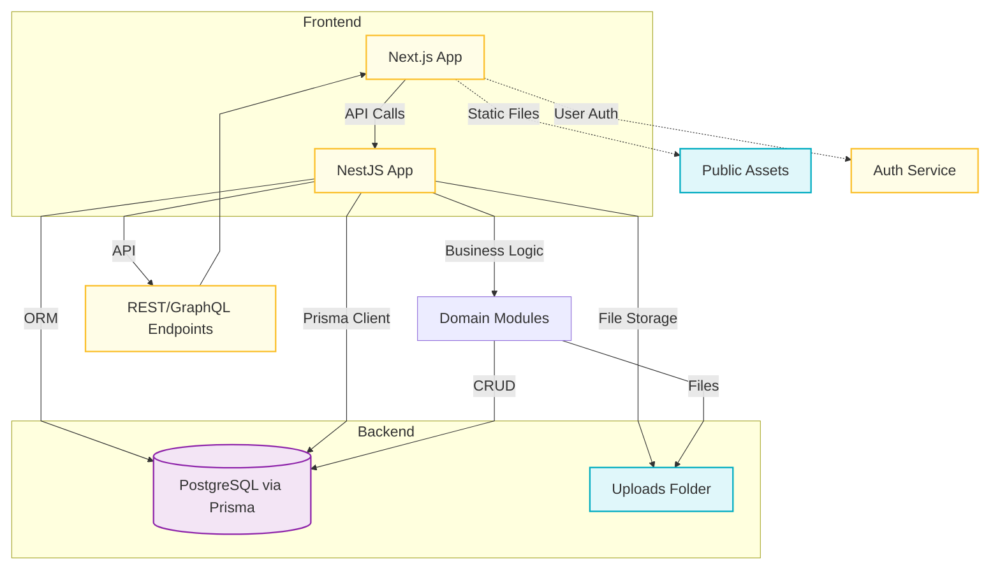
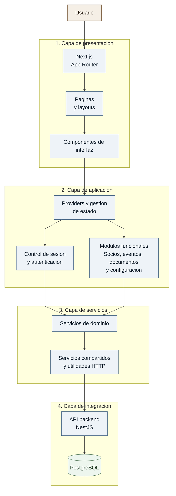

# Arquitectura General de la Aplicación

```mermaid
%%{init: {"flowchart": {"nodeSpacing": 55, "rankSpacing": 65, "diagramPadding": 16, "curve": "linear"}, "themeVariables": {"fontSize": "20px", "fontFamily": "Trebuchet MS, Verdana, sans-serif"}} }%%
flowchart TD
    subgraph Frontend
        FE[Next.js App]
        FE -->|API Calls| BE[Backend API]
    end

    subgraph Backend
        BE[NestJS App]
        BE -->|ORM| DB[(PostgreSQL via Prisma)]
        BE -->|File Storage| UPLOADS[Uploads Folder]
    end

    FE -.->|Static Files| PUBLIC[Public Assets]
    FE -.->|User Auth| AUTH[Auth Service]
    BE -->|Prisma Client| DB
    BE -->|Business Logic| MODULES[Domain Modules]
    MODULES -->|CRUD| DB
    MODULES -->|Files| UPLOADS
    BE -->|API| API[REST/GraphQL Endpoints]
    API --> FE

    classDef cloud fill:#e0f7fa,stroke:#00acc1,stroke-width:2px;
    classDef db fill:#f3e5f5,stroke:#8e24aa,stroke-width:2px;
    classDef logic fill:#fffde7,stroke:#fbc02d,stroke-width:2px;
    class FE,BE,API,AUTH logic;
    class DB db;
    class PUBLIC,UPLOADS cloud;
```

## Arquitectura del Frontend

```mermaid
%%{init: {"flowchart": {"nodeSpacing": 60, "rankSpacing": 70, "diagramPadding": 18, "curve": "linear"}, "themeVariables": {"fontSize": "20px", "fontFamily": "Trebuchet MS, Verdana, sans-serif"}} }%%
flowchart TB
    user[Usuario]

    subgraph presentation[1. Capa de presentacion]
        router[Next.js\nApp Router]
        pages[Paginas\ny layouts]
        ui[Componentes de interfaz]
        router --> pages --> ui
    end

    subgraph application[2. Capa de aplicacion]
        providers[Providers y gestion\nde estado]
        auth[Control de sesion\ny autenticacion]
        modules[Modulos funcionales\nSocios, eventos, documentos\ny configuracion]
        providers --> auth
        providers --> modules
    end

    subgraph services[3. Capa de servicios]
        domain[Servicios de dominio]
        shared[Servicios compartidos\ny utilidades HTTP]
        domain --> shared
    end

    subgraph integration[4. Capa de integracion]
        api[API backend\nNestJS]
        db[(PostgreSQL)]
        api --> db
    end

    user --> router
    ui --> providers
    auth --> domain
    modules --> domain
    shared --> api

    classDef actor fill:#f5efe6,stroke:#7a5c3e,color:#2b2118,stroke-width:1.5px;
    classDef layer fill:#eef3f8,stroke:#4c6a88,color:#13202d,stroke-width:1.2px;
    classDef data fill:#edf6ee,stroke:#567a5b,color:#16311a,stroke-width:1.2px;

    class user actor;
    class router,pages,ui,providers,auth,modules,domain,shared,api layer;
    class db data;
```
