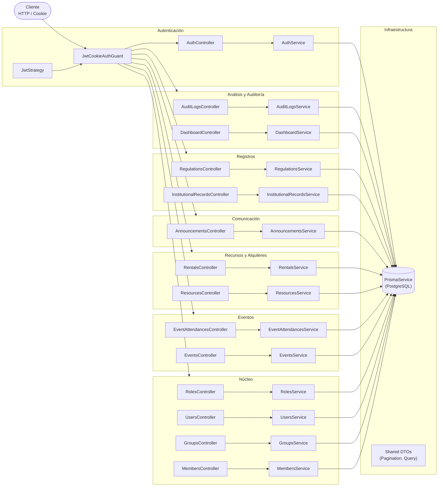

# Arquitectura del Backend — SGS

```mermaid
%%{init: {"flowchart": {"rankDir": "LR", "nodeSpacing": 40, "rankSpacing": 80}} }%%
flowchart LR

    Client(["Cliente\nHTTP / Cookie"])

    subgraph Auth["Autenticación"]
        JwtStrategy["JwtStrategy"]
        JwtGuard["JwtCookieAuthGuard"]
        AuthCtrl["AuthController"]
        AuthSvc["AuthService"]
        AuthCtrl --> AuthSvc
        JwtStrategy --> JwtGuard
    end

    subgraph Core["Núcleo"]
        MembersCtrl["MembersController"]
        MembersSvc["MembersService"]
        GroupsCtrl["GroupsController"]
        GroupsSvc["GroupsService"]
        UsersCtrl["UsersController"]
        UsersSvc["UsersService"]
        RolesCtrl["RolesController"]
        RolesSvc["RolesService"]
        MembersCtrl --> MembersSvc
        GroupsCtrl --> GroupsSvc
        UsersCtrl --> UsersSvc
        RolesCtrl --> RolesSvc
    end

    subgraph Events["Eventos"]
        EventsCtrl["EventsController"]
        EventsSvc["EventsService"]
        AttCtrl["EventAttendancesController"]
        AttSvc["EventAttendancesService"]
        EventsCtrl --> EventsSvc
        AttCtrl --> AttSvc
    end

    subgraph Rentals["Recursos y Alquileres"]
        ResCtrl["ResourcesController"]
        ResSvc["ResourcesService"]
        RentCtrl["RentalsController"]
        RentSvc["RentalsService"]
        ResCtrl --> ResSvc
        RentCtrl --> RentSvc
    end

    subgraph Comms["Comunicación"]
        AnnCtrl["AnnouncementsController"]
        AnnSvc["AnnouncementsService"]
        AnnCtrl --> AnnSvc
    end

    subgraph Records["Registros"]
        InstCtrl["InstitutionalRecordsController"]
        InstSvc["InstitutionalRecordsService"]
        RegCtrl["RegulationsController"]
        RegSvc["RegulationsService"]
        InstCtrl --> InstSvc
        RegCtrl --> RegSvc
    end

    subgraph Analytics["Análisis y Auditoría"]
        DashCtrl["DashboardController"]
        DashSvc["DashboardService"]
        AuditCtrl["AuditLogsController"]
        AuditSvc["AuditLogsService"]
        DashCtrl --> DashSvc
        AuditCtrl --> AuditSvc
    end

    subgraph Infra["Infraestructura"]
        PrismaSvc[("PrismaService\n(PostgreSQL)")]
        SharedDTOs["Shared DTOs\n(Pagination, Query)"]
    end

    Client --> JwtGuard
    JwtGuard --> AuthCtrl
    JwtGuard --> Core
    JwtGuard --> Events
    JwtGuard --> Rentals
    JwtGuard --> Comms
    JwtGuard --> Records
    JwtGuard --> Analytics

    MembersSvc --> PrismaSvc
    GroupsSvc --> PrismaSvc
    UsersSvc --> PrismaSvc
    RolesSvc --> PrismaSvc
    EventsSvc --> PrismaSvc
    AttSvc --> PrismaSvc
    ResSvc --> PrismaSvc
    RentSvc --> PrismaSvc
    AnnSvc --> PrismaSvc
    InstSvc --> PrismaSvc
    RegSvc --> PrismaSvc
    DashSvc --> PrismaSvc
    AuditSvc --> PrismaSvc
    AuthSvc --> PrismaSvc
```
