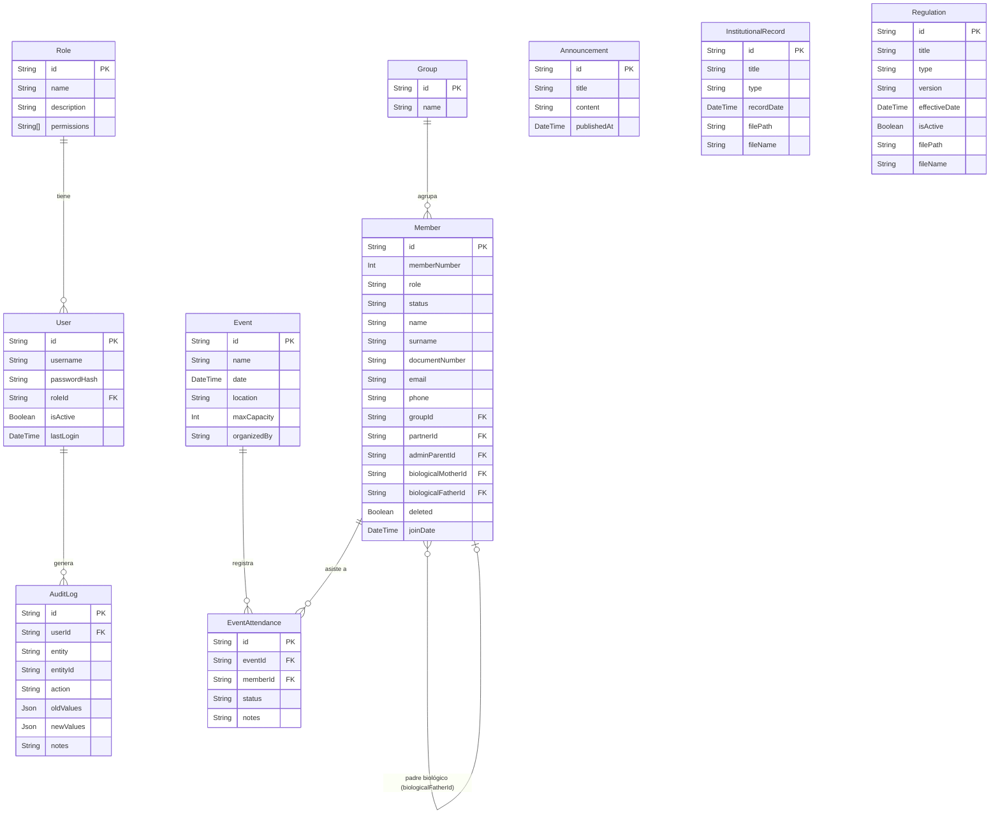

# Diagrama de Base de Datos — SGS

```mermaid
%%{init: {"er": {"layoutDirection": "LR"}} }%%
erDiagram

    Role {
        String id PK
        String name
        String description
        String[] permissions
    }

    User {
        String id PK
        String username
        String passwordHash
        String roleId FK
        Boolean isActive
        DateTime lastLogin
    }

    AuditLog {
        String id PK
        String userId FK
        String entity
        String entityId
        String action
        Json oldValues
        Json newValues
        String notes
    }

    Group {
        String id PK
        String name
    }

    Member {
        String id PK
        Int memberNumber
        String role
        String status
        String name
        String surname
        String documentNumber
        String email
        String phone
        String groupId FK
        String partnerId FK
        String adminParentId FK
        String biologicalMotherId FK
        String biologicalFatherId FK
        Boolean deleted
        DateTime joinDate
    }


    Event {
        String id PK
        String name
        DateTime date
        String location
        Int maxCapacity
        String organizedBy
    }

    EventAttendance {
        String id PK
        String eventId FK
        String memberId FK
        String status
        String notes
    }

    Announcement {
        String id PK
        String title
        String content
        DateTime publishedAt
    }

    InstitutionalRecord {
        String id PK
        String title
        String type
        DateTime recordDate
        String filePath
        String fileName
    }

    Regulation {
        String id PK
        String title
        String type
        String version
        DateTime effectiveDate
        Boolean isActive
        String filePath
        String fileName
    }

    %% Relaciones

    Role ||--o{ User : "tiene"
    User ||--o{ AuditLog : "genera"

    Group ||--o{ Member : "agrupa"

    Member }o--o| Member : "pareja (partnerId)"
    Member }o--o| Member : "tutor admin (adminParentId)"
    Member }o--o| Member : "madre biológica (biologicalMotherId)"
    Member }o--o| Member : "padre biológico (biologicalFatherId)"

    Event ||--o{ EventAttendance : "registra"
    Member ||--o{ EventAttendance : "asiste a"
```
