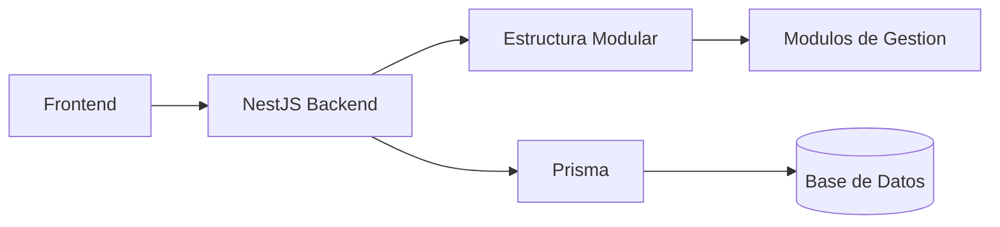

# Backend - First Idea

```mermaid
flowchart LR
    FE[Frontend]
    N[NestJS Backend]
    MOD[Estructura Modular]
    PM[Prisma]
    DB[(Base de Datos)]
    GM[Modulos de Gestion]

    FE --> N
    N --> MOD
    MOD --> GM
    N --> PM
    PM --> DB
```
