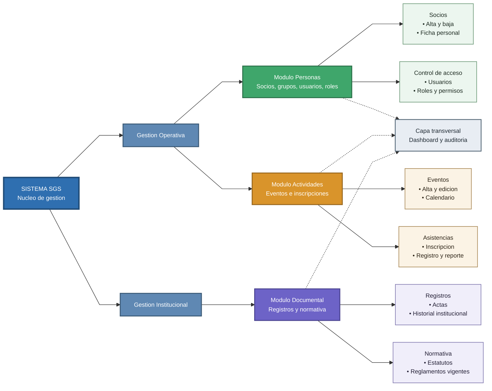

# Diseño Funcional del Sistema — Módulos Principales

```mermaid
%%{init: {"flowchart": {"rankDir": "LR", "nodeSpacing": 38, "rankSpacing": 90, "curve": "linear"}, "themeVariables": {"fontSize": "13px", "fontFamily": "Trebuchet MS, Verdana, sans-serif"}} }%%
flowchart LR

    Core["SISTEMA SGS<br/>Nucleo de gestion"]

    L1A["Gestion Operativa"]
    L1B["Gestion Institucional"]

    Core --> L1A
    Core --> L1B

    M1["Modulo Personas<br/>Socios, grupos, usuarios, roles"]
    M2["Modulo Actividades<br/>Eventos e inscripciones"]
    M3["Modulo Documental<br/>Registros y normativa"]

    L1A --> M1
    L1A --> M2
    L1B --> M3

    M1A["Socios<br/>• Alta y baja<br/>• Ficha personal"]
    M1B["Control de acceso<br/>• Usuarios<br/>• Roles y permisos"]

    M2A["Eventos<br/>• Alta y edicion<br/>• Calendario"]
    M2B["Asistencias<br/>• Inscripcion<br/>• Registro y reporte"]

    M3A["Registros<br/>• Actas<br/>• Historial institucional"]
    M3B["Normativa<br/>• Estatutos<br/>• Reglamentos vigentes"]

    M1 --> M1A
    M1 --> M1B
    M2 --> M2A
    M2 --> M2B
    M3 --> M3A
    M3 --> M3B

    T["Capa transversal<br/>Dashboard y auditoria"]
    M1 -.-> T
    M2 -.-> T
    M3 -.-> T

    style Core fill:#2F6FB0,stroke:#1F4B77,color:#fff,stroke-width:3px
    style L1A fill:#5F88B3,stroke:#3A5975,color:#fff,stroke-width:2px
    style L1B fill:#5F88B3,stroke:#3A5975,color:#fff,stroke-width:2px

    style M1 fill:#3FA66B,stroke:#2A6E47,color:#fff,stroke-width:2px
    style M2 fill:#D9942B,stroke:#96651D,color:#fff,stroke-width:2px
    style M3 fill:#6D63C7,stroke:#4A4390,color:#fff,stroke-width:2px

    style M1A fill:#ECF6EF,stroke:#6E9A79,color:#1E2B22,stroke-width:1.3px
    style M1B fill:#ECF6EF,stroke:#6E9A79,color:#1E2B22,stroke-width:1.3px
    style M2A fill:#FBF3E5,stroke:#A98856,color:#2E2518,stroke-width:1.3px
    style M2B fill:#FBF3E5,stroke:#A98856,color:#2E2518,stroke-width:1.3px
    style M3A fill:#F0EEFA,stroke:#837BB0,color:#242036,stroke-width:1.3px
    style M3B fill:#F0EEFA,stroke:#837BB0,color:#242036,stroke-width:1.3px

    style T fill:#E8EDF3,stroke:#5B6D7C,color:#1F2A33,stroke-width:1.8px
```
