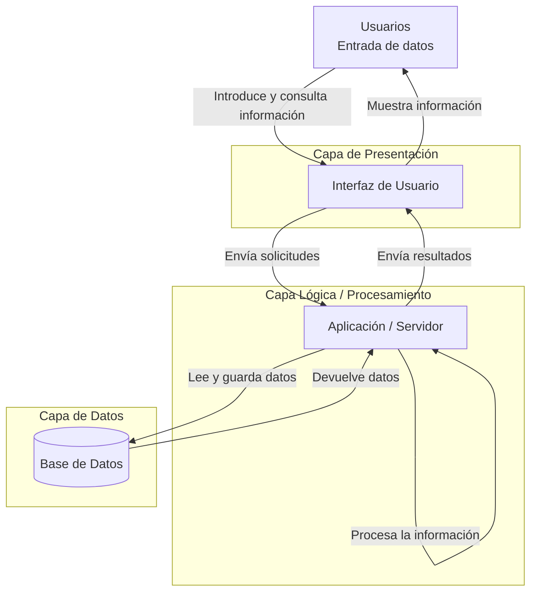

# Gestión de la Información: Arquitectura Básica del Sistema

Diagrama de 3 capas (presentación, lógica y datos) con flujo de información.

```mermaid
flowchart TD
    U[Usuarios\nEntrada de datos]

    subgraph P[Capa de Presentación]
        UI[Interfaz de Usuario]
    end

    subgraph L[Capa Lógica / Procesamiento]
        APP[Aplicación / Servidor]
    end

    subgraph D[Capa de Datos]
        DB[(Base de Datos)]
    end

    U -->|Introduce y consulta información| UI
    UI -->|Envía solicitudes| APP
    APP -->|Procesa la información| APP
    APP -->|Lee y guarda datos| DB
    DB -->|Devuelve datos| APP
    APP -->|Envía resultados| UI
    UI -->|Muestra información| U
```
