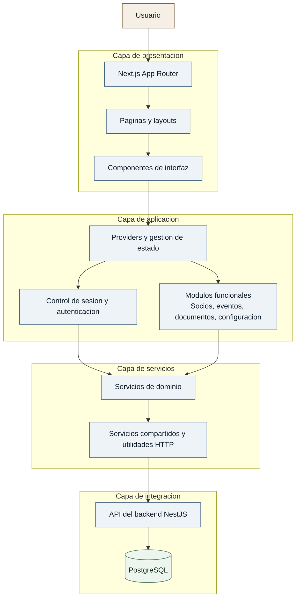
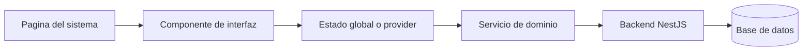

# Arquitectura del Frontend - SGS

Version pensada para documentacion academica. Se prioriza claridad visual sobre detalle de implementacion.

## Diagrama general de arquitectura

## Flujo funcional resumido

## Alcance del diagrama

- La capa de presentacion concentra navegacion, vistas y componentes reutilizables.
- La capa de aplicacion coordina estado global, sesion y logica funcional del frontend.
- La capa de servicios encapsula el acceso a datos y la comunicacion con el backend.
- La capa de integracion representa los sistemas externos consumidos por el frontend.

## Referencias internas

- Rutas y layouts: app/README.md
- Catalogo de componentes: components/README.md
- Servicios del frontend: services/README.md
