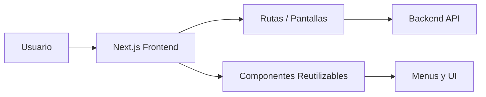

# Frontend - First Idea

```mermaid
flowchart LR
    U[Usuario]
    N[Next.js Frontend]
    R[Rutas / Pantallas]
    C[Componentes Reutilizables]
    M[Menus y UI]

    U --> N
    N --> R
    N --> C
    C --> M
    R --> B[Backend API]
```
