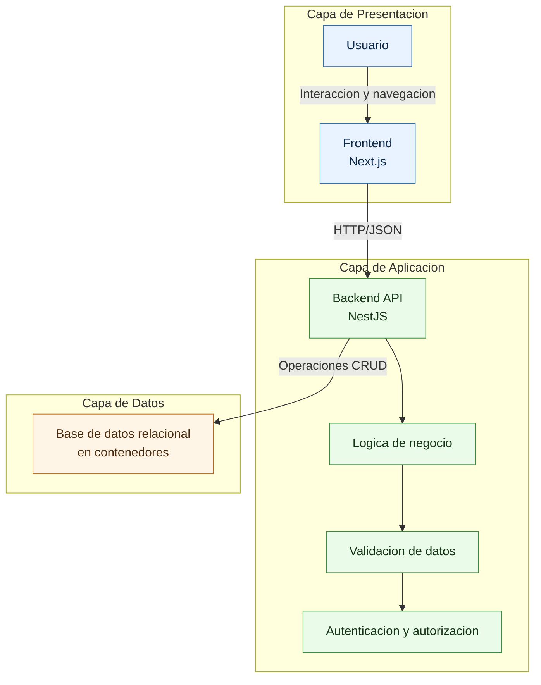

# Diagrama 1: Arquitectura Cliente-Servidor en Capas

Este diagrama representa la separación entre cliente, servidor y persistencia de datos descrita en el texto.

```mermaid
flowchart TB
    %% Capa de presentacion
    subgraph C1["Capa de Presentacion"]
        U["Usuario"]
        FE["Frontend<br/>Next.js"]
        U -->|"Interaccion y navegacion"| FE
    end

    %% Capa de aplicacion
    subgraph C2["Capa de Aplicacion"]
        API["Backend API<br/>NestJS"]
        LOG["Logica de negocio"]
        VAL["Validacion de datos"]
        AUTH["Autenticacion y autorizacion"]

        API --> LOG
        LOG --> VAL
        VAL --> AUTH
    end

    %% Capa de datos
    subgraph C3["Capa de Datos"]
        DB["Base de datos relacional<br/>en contenedores"]
    end

    FE -->|"HTTP/JSON"| API
    API -->|"Operaciones CRUD"| DB

    classDef presentation fill:#E8F3FF,stroke:#2F6DB3,stroke-width:1px,color:#0D2A4A;
    classDef application fill:#EAFBEA,stroke:#3D8A3D,stroke-width:1px,color:#153515;
    classDef data fill:#FFF5E6,stroke:#B36A1F,stroke-width:1px,color:#4A2A0D;

    class U,FE presentation;
    class API,LOG,VAL,AUTH application;
    class DB data;
```
