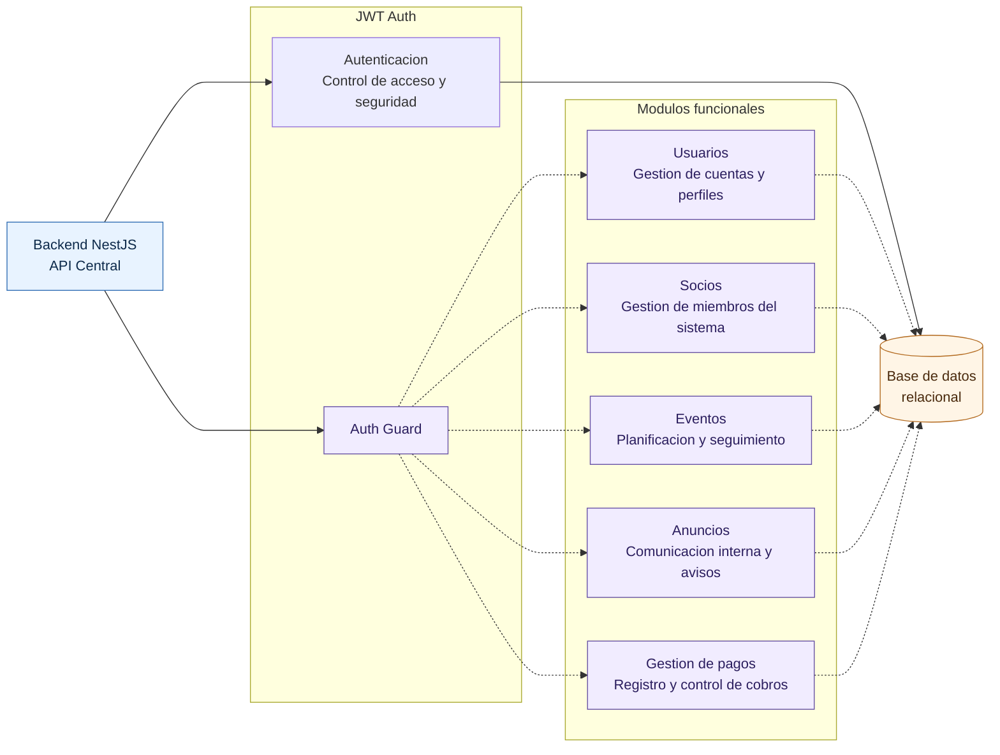

# Diagrama 2: Modulos Funcionales del Backend

Este diagrama muestra la organizacion modular del backend para favorecer mantenibilidad y escalabilidad.

```mermaid
flowchart LR
    CORE["Backend NestJS<br/>API Central"]

    CORE ---> AUTH
    AUTH --> DB

    subgraph INF["JWT Auth"]
        AUTH["Autenticacion<br/>Control de acceso y seguridad"]
        M1["Auth Guard"]
    end

    subgraph MOD["Modulos funcionales"]
        M2["Usuarios<br/>Gestion de cuentas y perfiles"]
        M3["Socios<br/>Gestion de miembros del sistema"]
        M4["Eventos<br/>Planificacion y seguimiento"]
        M5["Anuncios<br/>Comunicacion interna y avisos"]
        M6["Gestion de pagos<br/>Registro y control de cobros"]

        M1 -.-> M2
        M1 -.-> M3
        M1 -.-> M4
        M1 -.-> M5
        M1 -.-> M6
    end

    CORE ---> M1
    M2 -.-> DB
    M3 -.-> DB
    M4 -.-> DB
    M5 -.-> DB
    M6 -.-> DB


    DB[("Base de datos<br/>relacional")]

    classDef core fill:#E8F3FF,stroke:#2F6DB3,stroke-width:1px,color:#0D2A4A;
    classDef module fill:#F1ECFF,stroke:#6650A4,stroke-width:1px,color:#2B1E5E;
    classDef db fill:#FFF5E6,stroke:#B36A1F,stroke-width:1px,color:#4A2A0D;

    class CORE core;
    class M1,M2,M3,M4,M5,M6 module;
    class DB db;
```
